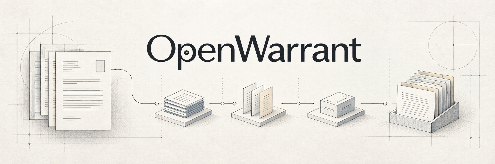
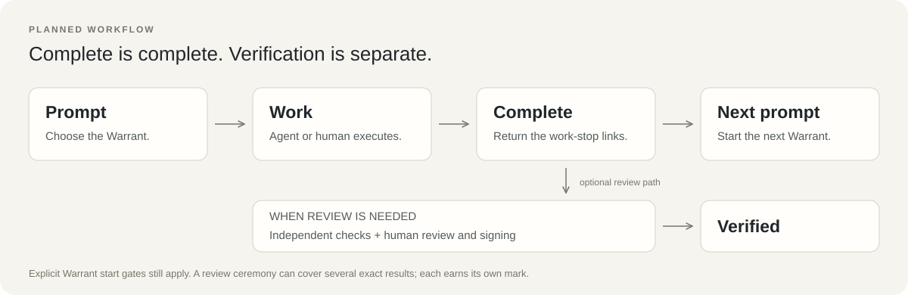
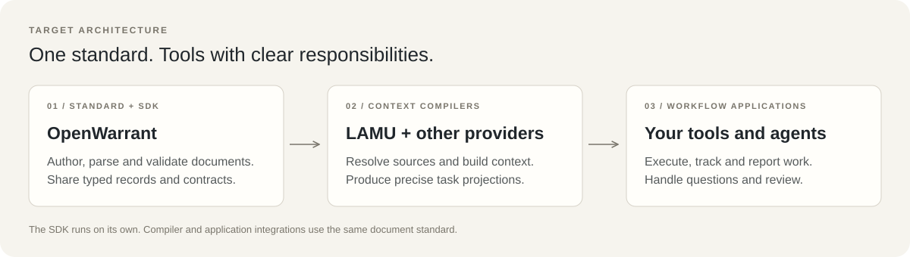

# OpenWarrant

**A document standard and SDK for work shared by humans and agents.**

Describe the outcome. Keep the right context. Record what happened.
Start small with a prompt, then add review and verification where your work needs it.

[Design draft](docs/sas/drafts/1.0.0-rc.3/README.md) ·
[Recorded progress](docs/warrants/generated/CORPUS_STATUS.md) ·
[Build the CLI](#build-the-current-cli) ·
[Contribute](CONTRIBUTING.md)

> **Under development.** The standard and SDK described here are the RC.3 design
> direction. This repository also contains the existing Rust libraries and `war`
> CLI, whose current formats and rules remain documented separately. Planned
> workflows and integrations are not claims of shipped functionality.

## One outcome, one Warrant

A **Warrant** describes a reviewable outcome, such as “add password reset.”
It can include scope, implementation guidance, architecture decisions, test fixtures,
questions, evidence and explicit start or signoff requirements. Internal stages
divide the work without making every file change a separate Warrant.

OpenWarrant gives tools a shared way to read these documents and preserve their
meaning. Requirements stay linked to their source. Work and review keep an honest
history. Agents spend less time reconstructing context; developers spend less time
copying records between tools.

The planned source format is readable Markdown with structured metadata and
defined sections. Small drafts remain useful before they contain execution or
verification records. WAR expands to **Work Authorization Record**; the everyday
name is **Warrant**.

## Work first. Review when needed.



Ordinary work is prompt-only: ask an agent to start a Warrant, let it work, receive
its completion response, then ask it to start the next one. Human work follows
the same record model.

**Complete · Unverified** and **Complete · Verified** both mean the work is complete.
Verification is a separate status. A Warrant can explicitly require a verified
prerequisite, preparation review or signoff before starting; those declared gates
still apply. OpenWarrant adds no universal signing ceremony to ordinary work.

When review is needed, independent checks and human review establish the result
against its declared requirements. Secure human acceptance is required for the
common Verified mark. One release review and signing ceremony can cover several
exact Warrant results. Their actual history and individual evidence remain visible.

## Short responses. Useful records.

At every completed work stop, the planned workflow returns the configured safeword
on the first line, followed by a compact set of links and next steps.

The linked progress overview is generated from tracker records. It contains
pending work, completion indicators, statistics and data views, plus implementation
notes and the document trail. Completion and verification are shown separately.
Configuration controls brevity and presentation; the agent need not paste large
documents or invent a new project-status summary in chat.

A work stop means its declared unit finished. An agent stop means execution paused;
work may remain unfinished. The tracker preserves both facts.

Agents can ask other agents or authorized humans for decisions during work.
Affected work pauses when needed; independent work can continue. Each Warrant's
worktree has one writer at a time, and the agent harness supplies execution isolation.

## A small core with clear boundaries



| Layer | Responsibility |
| --- | --- |
| **OpenWarrant standard + SDK** | Define documents and records; author, parse, validate and inspect supplied data; provide typed integration helpers. |
| **LAMU and other compilers** | Resolve source context, preserve exact applicable rules and build task projections. |
| **Workflow applications** | Run agents, track state, route questions, generate overviews and handle review/signing. |

Supervisors receive one progress view with pointers to decisions, draft amendments,
API contracts and skills. Workers receive relevant task context with exact required
rules. Cross-project work shares one Warrant contract, so teams do not maintain
drifting copies of the same requirements.

The SDK is intended to work without a model, database or running compiler.
AI can draft documents and implementation notes. Compilers and trackers produce
reproducible context and progress views from explicit inputs.

OpenWarrant also adapts methods from [Matt Pocock's skills](https://github.com/mattpocock/skills)
into `war` skills: clarification, specifications, decomposition and review produce
Warrants and related standard artifacts. See the [skill contract](docs/sas/drafts/1.0.0-rc.3/skill-adaptation.md).

## Delivery plan

| Phase | Deliverable |
| --- | --- |
| **1 · Library and Standard** | Define the standard and prove SDK primitives directly, then expose them through the CLI. |
| **2 · SDK and Compiler Integration** | Prove the SDK with LAMU and other consumers using shared fixtures and exact versioned inputs. |
| **3 · Workflow Integration** | Build a real reference webapp with first-party integrations, test applications and real users. |
| **4 · Hardening and Adoption** | Prove reliability, compatibility and release readiness; publish the stable standard. |

Read the [SAS candidate](docs/sas/drafts/1.0.0-rc.3/README.md),
[phase scope](docs/sas/drafts/1.0.0-rc.3/phase-plan.md) and
[concrete workflow cases](docs/sas/drafts/1.0.0-rc.3/prototype-and-release-cases.md).
For current repository records, use the [existing specification](docs/sas/WAR_Software_Architecture_Specification.md)
and [generated status](docs/warrants/generated/CORPUS_STATUS.md).

## Build the current CLI

Use the Rust toolchain pinned in `rust-toolchain.toml`.

```bash
git clone https://github.com/Quitetall/OpenWarrant
cd OpenWarrant
cargo build --release -p openwarrant-cli
./target/release/war --help
```

Or run `war ui` for the same in a browser on this machine: Progress on the
roadmap, updating live, the signing queue with each act's dry-run verdict,
and buttons that start the signature your key's dialog confirms
([docs/WEBUI.md](docs/WEBUI.md)).

Type `war` anywhere: outside a repository it opens **Projects**, every
repository you have used `war` in, remembered on use (`war projects`;
`OPENWARRANT_NO_PROJECTS=1` turns it off). Type `war` in a repository and,
at a terminal, it opens the app — setup,
help, the signing queue and every pane of the corpus, with the exact command
behind each row ([docs/TUI.md](docs/TUI.md)). It signs nothing itself; every
act runs `war sign --ssh-sign` in your terminal. On a pipe, `war` refuses by
name and points at `war status --json`.

Inspect this repository's existing records and generated-file consistency:

```bash
./target/release/war check --generated
```

That command checks records and generated-file drift. It does not run every
implementation test or provide human acceptance. The current format uses manifests
and authored atoms, with generated Markdown and JSON views.

[QUICKSTART.md](QUICKSTART.md) covers the current workflow.
Read [AGENTS.md](AGENTS.md) before agent work and
[CONTRIBUTING.md](CONTRIBUTING.md) for development checks.

## License

[Apache-2.0](LICENSE). Versions distributed before the 2026-09-12 relicensing
remain available under AGPL-3.0-or-later. See [RELICENSING.md](RELICENSING.md).
Adapted third-party skills retain their attribution and license notices.
